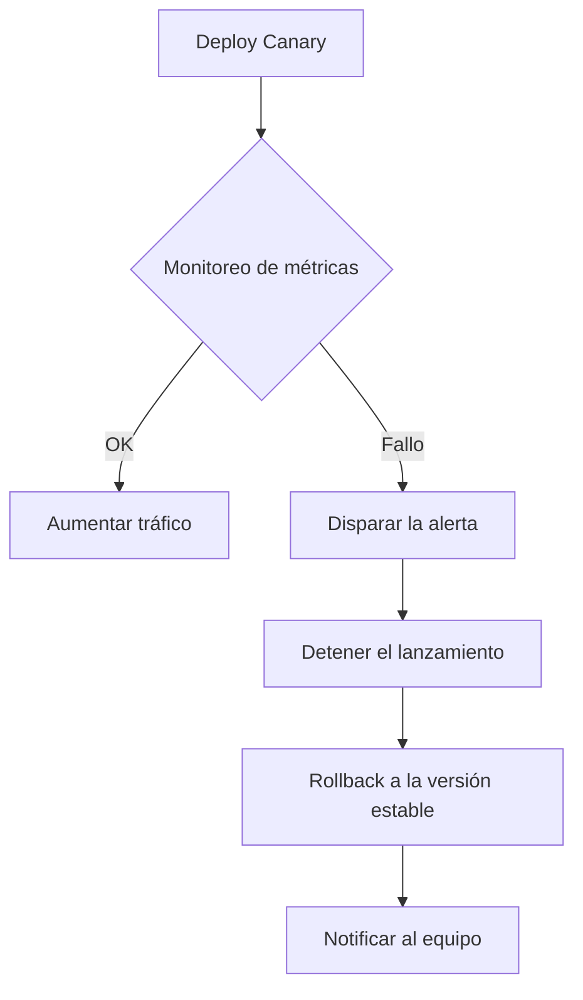
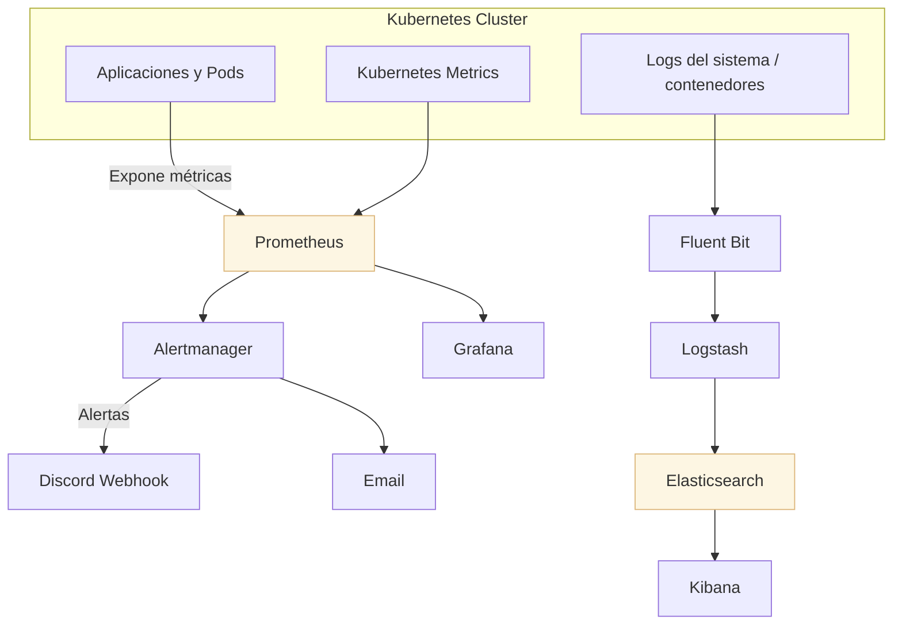

**PortTrack** ha sido contratada para desarrollar una plataforma inteligente de navegación portuaria que permita a las autoridades gestionar de forma eficiente y segura el flujo de embarcaciones en un puerto comercial. Esta solución debe abordar múltiples necesidades operativas críticas, como:

- Monitoreo en tiempo real de barcos y rutas marítimas.
- Gestión del inventario de embarcaciones y sus cargas.
- Coordinación del personal portuario en operaciones clave.
- Supervisión de entradas y salidas para optimizar el tráfico

## 🚧 Retos del Proyecto

Actualmente, la plataforma enfrenta desafíos relacionados con la estabilidad, escalabilidad y monitoreo continuo. El objetivo de este proyecto es diseñar una estrategia robusta de despliegue y observabilidad basada en prácticas DevOps y tecnologías. A continuación, se presentan los principales retos a enfrentar:

| Reto                                             | Descripción                                                                                          |
|--------------------------------------------------|------------------------------------------------------------------------------------------------------|
| **Procesamiento de Datos en Tiempo Real**        | La plataforma debe manejar gran volumen de información dinámica (barcos, cargas, rutas, clima, etc.). |
| **Despliegues Continuos sin Interrupciones**     | Se requieren estrategias CI/CD que permitan actualizaciones frecuentes sin afectar la operación.     |
| **Resiliencia ante Fallos y Rollbacks Seguros**  | Ante errores en producción, el sistema debe recuperar el estado anterior sin pérdida de datos.       |
| **Escalabilidad Horizontal y Vertical**          | Es necesario diseñar una arquitectura que escale automáticamente sin afectar el rendimiento.         |
| **Observabilidad Completa**                      | Se debe monitorear activamente el estado del sistema, detectar anomalías y centralizar métricas y logs. |
| **Seguridad y Protección de la Información**     | El entorno debe garantizar la protección de datos sensibles y la comunicación segura entre servicios. |
| **Coordinación de Equipos y Automatización**     | Las tareas deben estar automatizadas para minimizar errores humanos y facilitar el trabajo colaborativo. |

## 🚀 Estrategia de Despliegue Continuo 

Para una plataforma portuarias que gestiona operaciones críticas en tiempo real y donde la interrupción del servicio puede tener consecuencias significativas (pérdida de datos, problemas de seguridad, ineficiencia operativa), una estrategia de despliegue que minimice el riesgo y el tiempo de inactividad es esencial.

### Recomendacion: 🐤 Canary Deployment 

🐤 ¿Qué es el Canary Deployment?

**Canary Deployment** es una estrategia de despliegue progresivo que introduce una nueva versión de una aplicación en producción solo para una pequeña parte del tráfico o usuarios. Su objetivo es **minimizar el riesgo** al monitorear el comportamiento real de la nueva versión antes de realizar un cambio completo.

> El término proviene de los “canarios en las minas”, usados históricamente como sistemas de alerta temprana.

## 🔁 Flujo de Despliegue con Canary

| Etapa                         | Descripción                                                                                 |
|-------------------------------|---------------------------------------------------------------------------------------------|
| **1. Build y pruebas CI**     | La nueva versión se construye y pasa pruebas unitarias e integradas.                        |
| **2. Deploy parcial (Canary)**| Se despliega una pequeña cantidad de réplicas (ej. 5–10%) en producción.                    |
| **3. Distribución de tráfico**| El balanceador de tráfico envía una parte limitada del tráfico.                             |
| **4. Monitoreo y validación** | Se observan métricas, errores, logs y comportamiento general.                               |
| **5. Ampliación gradual**     | Si no se detectan problemas, se aumenta progresivamente el tráfico hacia la nueva versión.  |
| **6. Reemplazo completo**     | Todo el tráfico se dirige a la nueva versión una vez validada.                              |
| **7. Rollback (si falla)**    | Se elimina la versión canaria y se mantiene la estable si hay fallos.                       |

## 📈 Ejemplo de Distribución del Tráfico

| Fase                 | Tráfico versión estable  | Tráfico versión canaria  |
|----------------------|--------------------------|--------------------------|
| Inicial              | 95%                      | 10%                      |
| Después de validación| 75%                      | 25%                      |
| Ampliación gradual   | 50%                      | 50%                      |
| Final                | 0%                       | 100%                     |

## 🧱 Componentes necesarios

| Componente                        | Función                                                                 |
|-----------------------------------|-------------------------------------------------------------------------|
| **Service Mesh** (Istio)          | Controla y ajusta la distribución de tráfico entre versiones.           |
| **Monitoreo** (Prometheus)        | Detecta errores, latencias y métricas anómalas en tiempo real.          |
| **Alertas** (Grafana)             | Automatiza decisiones de continuar o detener el despliegue.             |
| **CI/CD** (GitHub Actions)        | Orquesta los pasos del pipeline canario progresivo.                     |


## 🚀 Ventajas de Usar GitHub Actions en Despliegues Canary

GitHub Actions permite automatizar y controlar despliegues Canary de forma segura y escalable. A continuación, se resumen sus principales beneficios:

| Funcionalidad                        | Beneficio para despliegue Canary                                                                 |
|-------------------------------------|--------------------------------------------------------------------------------------------------|
| **Automatización del flujo CI/CD**  | Automatiza pruebas, builds y despliegues sin intervención manual.                               |
| **Control de versiones gradual**    | Permite lanzar una versión nueva a un pequeño porcentaje de usuarios y aumentar progresivamente.|
| **Rollback automático**             | Si se detectan errores en la versión canaria, revierte a la versión estable sin afectar al resto del tráfico.|
| **Integración con Prometheus** | Ejecuta scripts de `kubectl`, y analiza métricas en tiempo real.                    |
| **Entornos diferenciados**          | Usa ramas (`dev`, `staging`, `main`) para desplegar en distintos entornos de forma controlada.  |
| **Notificaciones integradas**       | Envía alertas a Discord, Slack o correo electrónico si algo falla durante el despliegue.        |
| **Auditoría y trazabilidad**        | Registra cada cambio, quién lo hizo, y su impacto en el entorno, facilitando debugging y revisiones. |
| **Escalabilidad y reutilización**   | Permite definir workflows reutilizables para múltiples microservicios o entornos.               |

>✅ En resumen:
>GitHub Actions es fundamental en despliegues canary porque:
>🔁 automatiza, 🔍 monitorea, 🛡️ protege, y 📈 optimiza la liberación controlada de versiones en producción, minimizando riesgos y acelerando el feedback.

## 🔁 Estrategias de Rollback y Recuperación ante Fallos 

En un Canary Deployment, detectar errores a tiempo y revertir la nueva versión antes de que impacte al 100% del tráfico es fundamental.

### 🔁 Diagrama flujo de Rollback



## 🛑 Principales estrategias de rollback:

- Detener y revertir el canario	Si el monitoreo detecta fallos (latencia, errores 5xx, métricas críticas), se interrumpe el rollout y se eliminan los pods canarios.
- Automatización vía alertas	Herramientas como Prometheus + Alertmanager o Datadog pueden generar alertas que disparen el rollback automáticamente.
- Rollback en CI/CD	GitHub Actions puede tener pasos de rollback condicionados (if failure), o incluso tareas manuales para admins.
- Control de tráfico dinámico	Service Mesh como Istio permite redirigir todo el tráfico de nuevo a la versión estable sin eliminar la canaria.

---

## 🧪 Diferenciación de Entornos: DEV, STAGING, TEST y PRD

La estrategia CI/CD debe contemplar entornos aislados y bien definidos para controlar la calidad y estabilidad de la plataforma en cada etapa:

## 🔧 Diagrama de Diferenciación de Entornos

```plaintext
        ┌────────────────┐
        │   Código       │
        │  (GitHub)      │
        └─────┬──────────┘
              │ Push / PR
              ▼
        ┌────────────────┐
        │    DEV         │
        │ Desarrollo     │
        │ - Features     │
        │ - Cambios      │
        └─────┬──────────┘
              │ Merge
              ▼
        ┌────────────────┐
        │   TEST         │
        │ Pruebas unit   │
        │ - CI checks    │
        │ - Validación   │
        └─────┬──────────┘
              │ Aprobación QA
              ▼
        ┌────────────────┐
        │  STAGING       │
        │ Preproducción  │
        │ - Tests E2E    │
        └─────┬──────────┘
              │ Despliegue controlado
              ▼
        ┌────────────────┐
        │    PRD         │
        │ Producción     │
        │ - Usuarios     │
        │ - Metr. reales │
        └────────────────┘
```

| Entorno   | Propósito                                                                 | Características Clave                                       |
|-----------|---------------------------------------------------------------------------|--------------------------------------------------------------|
| **DEV**   | Desarrollo activo, pruebas de nuevas funcionalidades y prototipos         | Despliegues automáticos por push. Permite errores y cambios frecuentes. |
| **TEST**  | Validación funcional con pruebas unitarias e integración                  | Automatización de pruebas. Datos simulados.                  |
| **STAGING** | Preproducción, entorno espejo del productivo para pruebas integradas     | Validación completa de flujos reales. Igual configuración que PRD. |
| **PRD**   | Entorno de producción accesible por usuarios finales                      | Alta disponibilidad. Seguridad reforzada. |

## 🚀 Descripción del Workflow de Despliegue (.github/workflows/deploy.yml)

Este workflow de GitHub Actions automatiza el proceso de construcción y despliegue de la aplicación a entornos diferenciados: Staging y Producción. Se ejecuta automáticamente cuando se realiza un push de una etiqueta (v*) o manualmente mediante el selector de entorno (workflow_dispatch).

### 📦 Disparadores
```yaml
on:
  push:
    tags:
      - "v*"
  workflow_dispatch:
    inputs:
      environment:
        type: choice
        options:
          - staging
          - production
```
- push con tags tipo v1.0.0: despliega automáticamente a staging.
- workflow_dispatch: permite ejecutar manualmente el despliegue y elegir entre staging o production.

🌐 Variables Globales
```yaml
env:
  REGISTRY: ghcr.io
  IMAGE_NAME: ${{ github.repository }}
```
- Define el registry (ghcr.io) y el nombre de la imagen como el repositorio actual (usuario/repositorio).
  - 🔧 Jobs definidos
  - 🧪 deploy-staging

- Ejecutado automáticamente en push de tag o manualmente seleccionando staging.
Pasos:

    1. Clonación del código fuente

    2. Configuración de Docker Buildx para builds multi-arquitectura

    3. Inicio de sesión en GitHub Container Registry (ghcr.io)

    4. Extracción de metadatos para etiquetar la imagen como :staging

    5. Build y push de la imagen Docker con caché

    6. Despliegue a staging

    7. Health check básico (puede extenderse con scripts de verificación)

### 🚀 deploy-production

- Ejecutado solo manualmente seleccionando el entorno production.
Diferencias clave:

  - Imagen se etiqueta como :latest
  -  Requiere ejecución manual
  -  Ideal para integrar revisiones o aprobaciones antes de producción

### 🔔 notify (Notificación de estado)

- Este job se ejecuta siempre, sin importar si los despliegues anteriores fueron exitosos o fallidos.

  - Si tuvo éxito:
    - 🎉 Deployment completed successfully!

  - Si falló:
    - ❌ Deployment failed!

>Aquí puedes integrar notificaciones a Slack, Discord, Email o Webhooks.

## 🔐 Gestión de Credenciales y Secretos

-La gestión segura de credenciales y secretos (como contraseñas, claves API, tokens de acceso y certificados) es crítica en entornos de producción. Exponerlos, incluso accidentalmente, puede llevar a brechas de seguridad devastadoras. 

- Para proteger las credenciales en entornos de producción, se deben seguir las siguientes prácticas clave:

  - ✅ **Uso de GitHub Secrets**: Almacenar claves de API, tokens y credenciales en el entorno seguro de GitHub Actions.
  - 🔒 **Separación por entorno**: Secretos distintos para DEV, STAGING y PRD.
  - 🔁 **Rotación periódica**: Actualizar credenciales sensibles de forma regular.
  - 🚫 **No exponer en logs**: Usar `secrets.*` en GitHub para ocultarlos en la salida del pipeline.

---

## 🛡️ Consideraciones de Seguridad en el Pipeline de Despliegue

En entornos críticos como plataformas de navegación y logística portuaria, la seguridad del pipeline CI/CD es esencial. A continuación se detallan algunas prácticas recomendadas:

### 🔒 1. Uso de Variables y Secretos Seguros

- Almacena claves, tokens y credenciales en **GitHub Secrets**, no en el código fuente.
- Evita mostrar secretos en logs con `echo` o en outputs del pipeline.

```yaml
# Para despliegue
DEPLOY_SSH_KEY          # Clave SSH para servidor de despliegue
DEPLOY_HOST             # Host del servidor
DEPLOY_USER             # Usuario del servidor

# Para notificaciones con Discord
DISCORD_WEBHOOK_URL     
```

### ✅ 2. Validación y Revisión de Código en PRs

- Habilita branch protection rules para main/production:
  - Revisión de al menos 1 miembro del equipo.
  - Tests exitosos antes de permitir el merge.
  - Ejecuta workflows solo en PRs aprobados y ramas confiables:

```yaml
on:
  pull_request:
    branches:
      - main
jobs:
  build:
    if: github.event.pull_request.merged == true
```

### 🔐 3. Control de Accesos y Permisos

- Usa GitHub Environments con aprobaciones manuales para producción.
  -  ejemplo: 
    - **staging**: Para despliegues de staging.
    - **production**: Para despliegues de producción.

- Limita el acceso a runners sensibles o auto-hospedados.
- Evitar privilegios excesivos en los scripts de despliegue.

Los workflows requieren estos permisos:

```yaml
permissions:
  contents: read
  packages: write
  security-events: write
  actions: read
```

🧪 4. Validación de Artefactos y Seguridad del Código

- Escanea vulnerabilidades con herramientas como:
  - 🔍 Trivy (vulnerabilidades)
  - 🔍 Bandit (análisis de código Python)
  - 🔍 pip-audit (auditoría de dependencias)
  - 🔍 Hadolint (linting de Dockerfile)

```yaml
name: 🔐 Security Scans

on:
  push:
    branches: [main, canary, dev]
  pull_request:
    branches: [main]

jobs:
  security-scan:
    name: 🔎 Escaneo de seguridad
    runs-on: ubuntu-latest

    steps:
    - name: 📥 Clonar repositorio
      uses: actions/checkout@v3

    # -------------------------------
    # 🔍 Trivy - Escaneo de vulnerabilidades
    # -------------------------------
    - name: 🐳 Trivy (Dockerfile y dependencias)
      uses: aquasecurity/trivy-action@master
      with:
        scan-type: fs
        scan-ref: .
        format: table
        exit-code: 1  # Falla si encuentra vulnerabilidades altas o críticas
        severity: CRITICAL,HIGH

    # -------------------------------
    # 🐍 Bandit - Análisis de seguridad Python
    # -------------------------------
    - name: 🔍 Bandit (código Python)
      run: |
        pip install bandit
        bandit -r . -lll -ii -o bandit-report.txt || true
        cat bandit-report.txt

    # -------------------------------
    # 🧪 pip-audit - Dependencias Python
    # -------------------------------
    - name: 📦 pip-audit (dependencias inseguras)
      run: |
        pip install pip-audit
        pip-audit || true

    # -------------------------------
    # 🧱 Hadolint - Análisis Dockerfile
    # -------------------------------
    - name: 🧼 Hadolint (Dockerfile)
      uses: hadolint/hadolint-action@v3.1.0
      with:
        dockerfile: ./Dockerfile
```
>archivo .github/workflows/security.yml


🚨 5. Notificaciones ante Fallos o Actividad Sospechosa

- Notifica vía Discord, Slack o email si un despliegue falla.
- Integra con SIEM o herramientas de monitoreo para alertas en tiempo real.

```yaml
- name: Notificación de error en Discord
  if: failure()
  uses: Ilshidur/action-discord@v1
  with:
    webhook: ${{ secrets.DISCORD_WEBHOOK }}
    message: "⚠️ Fallo en el pipeline de despliegue."
```

Un pipeline seguro garantiza integridad, autenticidad y confidencialidad durante el proceso de despliegue:

| Riesgo                           | Mitigación                                                                 |
|----------------------------------|----------------------------------------------------------------------------|
| **Filtración de secretos**       | Uso de variables encriptadas (`secrets.GITHUB_TOKEN`, `AWS_ACCESS_KEY`)   |
| **Código malicioso en PRs**      | Revisión obligatoria de código antes de ejecutar workflows en ramas protegidas |
| **Acceso no autorizado**         | Uso de GitHub Environments con aprobación manual en PRD                   |
| **Fugas en logs**                | Evitar `echo` de datos sensibles. Revisar outputs antes de aprobar un Pull Request .   |

---
## 📊 Implementación de Monitoreo Continuo

La plataforma de navegación portuaria requiere visibilidad completa sobre el comportamiento de los servicios, infraestructura y flujos marítimos en tiempo real. Para lograrlo, se implementa una estrategia integral de **monitoreo y observabilidad**.

### 📌 Beneficios del Monitoreo Continuo

- Prevención de incidentes antes de que afecten a producción.
- Visibilidad completa del sistema distribuido.
- Facilidad de diagnóstico durante fallos o degradaciones.
- Mejora de la seguridad y trazabilidad operativa.

### 🛠️ 1. Selección de Herramientas de Monitoreo y Observabilidad

| Herramienta         | Función Principal                                         | Ventajas Clave                                         |
|---------------------|-----------------------------------------------------------|--------------------------------------------------------|
| **Prometheus**      | Recolección y almacenamiento de métricas (time-series)    | Alta integración con Kubernetes, potente lenguaje de consulta (PromQL) |
| **Grafana**         | Visualización de métricas y creación de dashboards        | Soporte para alertas, paneles personalizables, integración con múltiples fuentes |
| **Alertmanager**    | Gestión y envío de alertas basadas en reglas de Prometheus| Integración con Discord, Slack, Email, etc.            |
| **Fluent Bit**      | Recolección y envío de logs liviano desde contenedores    | Bajo consumo, integración directa con Kubernetes y ELK |
| **Elasticsearch**   | Almacenamiento e indexación de logs                       | Alta velocidad de búsqueda y escalabilidad horizontal  |
| **Logstash**        | Procesamiento y envío de logs hacia Elasticsearch         | Flexibilidad en el pipeline de datos                   |
| **Kibana**          | Visualización y análisis de logs                          | UI potente para trazabilidad y búsquedas 
|

### 🔎 Estrategia de manejo de logs y métricas

- **Logs**:
  - **Fluent Bit** capta los logs de contenedores.
  - Pasa la información a **Logstash**, que la procesa.
  - Luego se almacena en **Elasticsearch** y se visualiza en **Kibana**.
    
- **Métricas**:
  - Aplicaciones y servicios exponen datos que son recolectados por **Prometheus**.
  - Estos datos se visualizan con **Grafana**.
  - **Alertmanager** se encarga de generar alertas cuando hay valores críticos.


## ⚙️ Configuración de Alertas y Dashboards
Configurar alertas y dashboards correctamente es clave para detectar incidentes tempranos y mantener la estabilidad de tu plataforma. 

Ejemplos:

### 🔔 1. Alertas con Prometheus y Alertmanager
- a) Define las reglas de alerta (prometheus.yml )

```yaml
groups:
  - name: reglas_alerta
    rules:
      - alert: UsoAltoCPU
        expr: avg(rate(container_cpu_usage_seconds_total[1m])) by (pod) > 0.85
        for: 2m
        labels:
          severity: warning
        annotations:
          summary: "Uso alto de CPU en {{ $labels.pod }}"
          description: "El pod {{ $labels.pod }} está usando más del 85% de CPU por más de 2 minutos."
```
b) Configura Alertmanager (alertmanager.yml)
```yaml
receivers:
  - name: equipo-devops
    discord_configs:
      - webhook_url: 'https://discord.com/api/webhooks/...'
        message: '{{ .CommonAnnotations.summary }}\n{{ .CommonAnnotations.description }}'

route:
  receiver: equipo-devops
  group_wait: 30s
  repeat_interval: 1h
```
>✅ Consejo: Puedes agregar más receptores (Slack, email, etc.)
