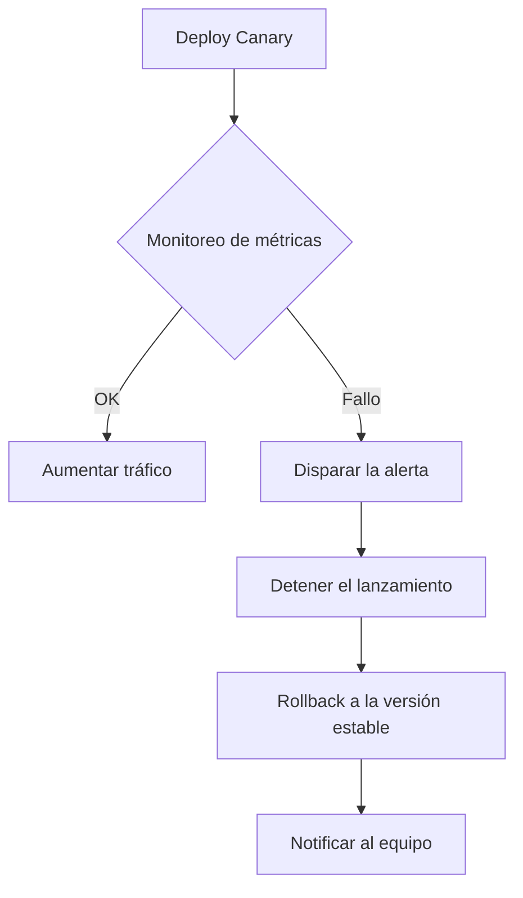

**PortTrack** ha sido contratada para desarrollar una plataforma inteligente de navegación portuaria que permita a las autoridades gestionar de forma eficiente y segura el flujo de embarcaciones en un puerto comercial. Esta solución debe abordar múltiples necesidades operativas críticas, como:

- Monitoreo en tiempo real de barcos y rutas marítimas.
- Gestión del inventario de embarcaciones y sus cargas.
- Coordinación del personal portuario en operaciones clave.
- Supervisión de entradas y salidas para optimizar el tráfico

## 🚧 Retos del Proyecto

Actualmente, la plataforma enfrenta desafíos relacionados con la estabilidad, escalabilidad y monitoreo continuo. El objetivo de este proyecto es diseñar una estrategia robusta de despliegue y observabilidad basada en prácticas DevOps y tecnologías. A continuación, se presentan los principales retos a enfrentar:

| Reto                                             | Descripción                                                                                          |
|--------------------------------------------------|------------------------------------------------------------------------------------------------------|
| **Procesamiento de Datos en Tiempo Real**        | La plataforma debe manejar gran volumen de información dinámica (barcos, cargas, rutas, clima, etc.). |
| **Despliegues Continuos sin Interrupciones**     | Se requieren estrategias CI/CD que permitan actualizaciones frecuentes sin afectar la operación.     |
| **Resiliencia ante Fallos y Rollbacks Seguros**  | Ante errores en producción, el sistema debe recuperar el estado anterior sin pérdida de datos.       |
| **Escalabilidad Horizontal y Vertical**          | Es necesario diseñar una arquitectura que escale automáticamente sin afectar el rendimiento.         |
| **Observabilidad Completa**                      | Se debe monitorear activamente el estado del sistema, detectar anomalías y centralizar métricas y logs. |
| **Seguridad y Protección de la Información**     | El entorno debe garantizar la protección de datos sensibles y la comunicación segura entre servicios. |
| **Coordinación de Equipos y Automatización**     | Las tareas deben estar automatizadas para minimizar errores humanos y facilitar el trabajo colaborativo. |

## 🚀 Estrategia de Despliegue Continuo 

Para una plataforma portuarias que gestiona operaciones críticas en tiempo real y donde la interrupción del servicio puede tener consecuencias significativas (pérdida de datos, problemas de seguridad, ineficiencia operativa), una estrategia de despliegue que minimice el riesgo y el tiempo de inactividad es esencial.

### Recomendacion: 🐤 Canary Deployment 

🐤 ¿Qué es el Canary Deployment?

**Canary Deployment** es una estrategia de despliegue progresivo que introduce una nueva versión de una aplicación en producción solo para una pequeña parte del tráfico o usuarios. Su objetivo es **minimizar el riesgo** al monitorear el comportamiento real de la nueva versión antes de realizar un cambio completo.

> El término proviene de los “canarios en las minas”, usados históricamente como sistemas de alerta temprana.

## 🔁 Flujo de Despliegue con Canary

| Etapa                         | Descripción                                                                                 |
|-------------------------------|---------------------------------------------------------------------------------------------|
| **1. Build y pruebas CI**     | La nueva versión se construye y pasa pruebas unitarias e integradas.                        |
| **2. Deploy parcial (Canary)**| Se despliega una pequeña cantidad de réplicas (ej. 5–10%) en producción.                    |
| **3. Distribución de tráfico**| El balanceador de tráfico envía una parte limitada del tráfico.                             |
| **4. Monitoreo y validación** | Se observan métricas, errores, logs y comportamiento general.                               |
| **5. Ampliación gradual**     | Si no se detectan problemas, se aumenta progresivamente el tráfico hacia la nueva versión.  |
| **6. Reemplazo completo**     | Todo el tráfico se dirige a la nueva versión una vez validada.                              |
| **7. Rollback (si falla)**    | Se elimina la versión canaria y se mantiene la estable si hay fallos.                       |

## 📈 Ejemplo de Distribución del Tráfico

| Fase                 | Tráfico versión estable  | Tráfico versión canaria  |
|----------------------|--------------------------|--------------------------|
| Inicial              | 95%                      | 5%                       |
| Después de validación| 75%                      | 25%                      |
| Ampliación gradual   | 50%                      | 50%                      |
| Final                | 0%                       | 100%                     |

## 🧱 Componentes necesarios

| Componente                        | Función                                                                 |
|-----------------------------------|-------------------------------------------------------------------------|
| **Service Mesh** (Istio, Linkerd) | Controla y ajusta la distribución de tráfico entre versiones.           |
| **Monitoreo** (Prometheus)        | Detecta errores, latencias y métricas anómalas en tiempo real.          |
| **Alertas** (Grafana)             | Automatiza decisiones de continuar o detener el despliegue.             |
| **CI/CD** (GitHub Actions)        | Orquesta los pasos del pipeline canario progresivo.                     |

## 🚀 Ventajas de Usar GitHub Actions en Despliegues Canary

GitHub Actions permite automatizar y controlar despliegues Canary de forma segura y escalable. A continuación, se resumen sus principales beneficios:

| Funcionalidad                        | Beneficio para despliegue Canary                                                                 |
|-------------------------------------|--------------------------------------------------------------------------------------------------|
| **Automatización del flujo CI/CD**  | Automatiza pruebas, builds y despliegues sin intervención manual.                               |
| **Control de versiones gradual**    | Permite lanzar una versión nueva a un pequeño porcentaje de usuarios y aumentar progresivamente.|
| **Rollback automático**             | Si se detectan errores en la versión canaria, revierte a la versión estable sin afectar al resto del tráfico.|
| **Integración con Prometheus** | Ejecuta scripts de `kubectl`, y analiza métricas en tiempo real.                    |
| **Entornos diferenciados**          | Usa ramas (`dev`, `staging`, `main`) para desplegar en distintos entornos de forma controlada.  |
| **Notificaciones integradas**       | Envía alertas a Discord, Slack o correo electrónico si algo falla durante el despliegue.        |
| **Auditoría y trazabilidad**        | Registra cada cambio, quién lo hizo, y su impacto en el entorno, facilitando debugging y revisiones. |
| **Escalabilidad y reutilización**   | Permite definir workflows reutilizables para múltiples microservicios o entornos.               |

>✅ En resumen:
>GitHub Actions es fundamental en despliegues canary porque:
>🔁 automatiza, 🔍 monitorea, 🛡️ protege, y 📈 optimiza la liberación controlada de versiones en producción, minimizando riesgos y acelerando el feedback.

## 🔁 Estrategias de Rollback y Recuperación ante Fallos 

En un Canary Deployment, detectar errores a tiempo y revertir la nueva versión antes de que impacte al 100% del tráfico es fundamental.

### 🔁 Diagrama flujo de Rollback

## 🛑 Principales estrategias de rollback:

- Detener y revertir el canario	Si el monitoreo detecta fallos (latencia, errores 5xx, métricas críticas), se interrumpe el rollout y se eliminan los pods canarios.
- Automatización vía alertas	Herramientas como Prometheus + Alertmanager o Datadog pueden generar alertas que disparen el rollback automáticamente.
- Rollback en CI/CD	GitHub Actions puede tener pasos de rollback condicionados (if failure), o incluso tareas manuales para admins.
- Control de tráfico dinámico	Service Mesh como Istio permite redirigir todo el tráfico de nuevo a la versión estable sin eliminar la canaria.

---

## 🧪 Diferenciación de Entornos: DEV, STAGING, TEST y PRD

La estrategia CI/CD debe contemplar entornos aislados y bien definidos para controlar la calidad y estabilidad de la plataforma en cada etapa:

| Entorno   | Propósito                                                                 | Características Clave                                       |
|-----------|---------------------------------------------------------------------------|--------------------------------------------------------------|
| **DEV**   | Desarrollo activo, pruebas de nuevas funcionalidades y prototipos         | Despliegues automáticos por push. Permite errores y cambios frecuentes. |
| **TEST**  | Validación funcional con pruebas unitarias e integración                  | Automatización de pruebas. Datos simulados.                  |
| **STAGING** | Preproducción, entorno espejo del productivo para pruebas integradas     | Validación completa de flujos reales. Igual configuración que PRD. |
| **PRD**   | Entorno de producción accesible por usuarios finales                      | Alta disponibilidad. Seguridad reforzada. |

---

## 🔐 Gestión de Credenciales y Secretos

La protección de credenciales en entornos productivos es crítica. Se deben seguir estas prácticas:

- ✅ **Uso de GitHub Secrets**: Almacenar claves de API, tokens y credenciales en el entorno seguro de GitHub Actions.
- 🔒 **Separación por entorno**: Secretos distintos para DEV, STAGING y PRD.
- 🔁 **Rotación periódica**: Actualizar credenciales sensibles de forma regular.
- 🚫 **No exponer en logs**: Usar `secrets.*` en GitHub para ocultarlos en la salida del pipeline.

---

## 🛡️ Consideraciones de Seguridad en el Pipeline de Despliegue

Un pipeline seguro garantiza integridad, autenticidad y confidencialidad durante el proceso de despliegue:

| Riesgo                            | Mitigación                                                                 |
|----------------------------------|----------------------------------------------------------------------------|
| **Filtración de secretos**       | Uso de variables encriptadas (`secrets.GITHUB_TOKEN`, `AWS_ACCESS_KEY`)   |
| **Código malicioso en PRs**      | Revisión obligatoria de código antes de ejecutar workflows en ramas protegidas |
| **Acceso no autorizado**         | Uso de GitHub Environments con aprobación manual en PRD                   |
| **Fugas en logs**                | Evitar `echo` de datos sensibles. Revisar outputs antes de aprobar un Pull Request .   |

---

